Данный проект представляет собой Java-приложение, которое позволяет пользователю как менеджеру управлять условным автопарком.

**О проекте и технологиях**
 
Данный проект был создан в процессе обучения основным технологиям программной разработки и включает в себя применение таких инструментов как  
**Spring Framework(Spring boot, Security, MVC, JPA, Hibernate),  
SQL(Postgres+H2),   
REST, cURL,  
Docker, Kafka, 
Reactive, Webflux,  
Micrometer, Prometheus, Grafana,   	
Assets,  
telegramm bot,  
OpenRoute,  
Junit5, Testcontainers, Playwright,  
Swagger,  
Git,  
Lombok,   
CI/CD,  
Thymeleaf, HTML, Bootstrap, JS, CSS.**  

Инструмент  разработки - IntelliJ IDEA
Сборка осуществляется Maven.
Проект также развёрнут на удалённом сервере(VPS) через создание собственного домена и его настройкой, c применением nginx, let's encrypt, и деплоем посредством CI/CD.
Отдельным пунктом были созданы интеграционные и e2e тесты, проведено нагрузочное тестирование, что в результате дало показания в 1000 RPS (в применении сервера mvc)

Проект является учебным и, конечно, в остатке имеет много вопросов к доработке и его приведению к надлежащему виду. Начав бы его заново, я несколько по иному подошёл ко многим моментам. Критические замечания, несомненно, имеют место быть и принимаются во внимание. Но с точки зрения апробирования базовых технологий, данный проект является законченным.

Что должно быть установлено: Java + Maven + Docker

Краткое содержание: 
- [Обзор приложения autopark](#обзор-приложения-autopark)
- [Режимы запуска ](#режимы-запуска)
- [Запуск кластера A](#запуск-кластера-a)
- [Запуск кластера B](#запуск-кластера-b)
- [Запуск кластера C](#запуск-кластера-c)

## Обзор приложения

**Авторизация**

Для входа в приложение необходимо пройти авторизацию. Стандартный логин/пароль - m1:p1/m2:p2. 

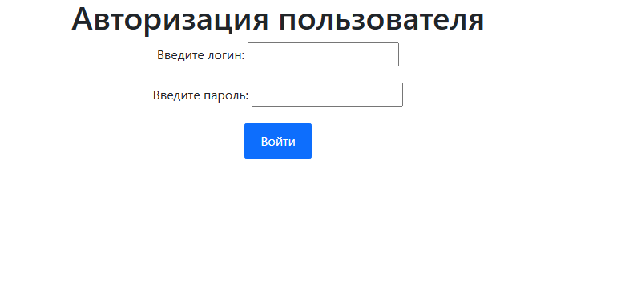

**Список предприятий**

У каждого менеджера имеется несколько предприятий(Many to Many). Можно изменить данные о предприятии, а также создать новое.  
Во избежание озорных названий, принято решение ограничиться рядом возможных вариантов, представленных в выпадающих списках. **(в разработке)**  
Также вы можете удалить созданное вами предприятие. Однако предполагается, что базовые 3 предприятия, удалению не подлежат **(в разработке)**

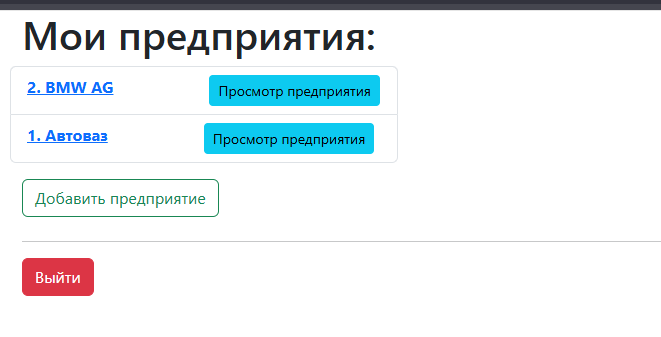

**Автомобиль**

Каждое предприятие имеет свой условный автопарк (One To Many). Страница даёт выдачу списка по  10 автомобилей.

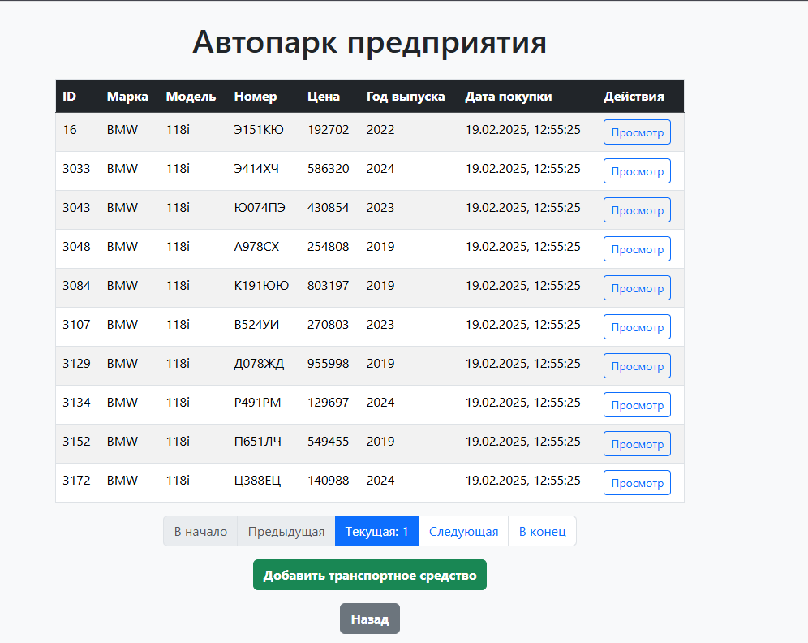

По умолчанию список автомобилей отсортирован по названию транспортного средства(ТС).   
Их можно отсортировать по ID и регистрационному номеру.**(в разработке)**   
По регистрационному номеру можно осуществить поиск конкретного ТС.**(в разработке)**  
У автомобилей также присутствуют все CRUD операции. Создание/изменение осуществляется в форме с валидацией полей. Важное уточнение - повторно создать автомобиль с одним и тем же регистрационным номером - нельзя (а он может присутствовать в уже имеющейся БД)

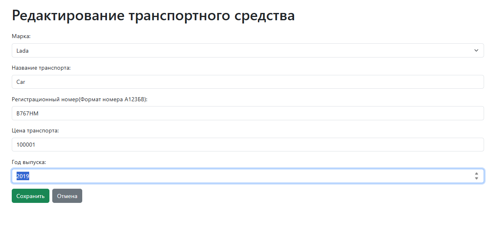

Предоставлена функция генерации 5 автомобилей с рандомными данными. **(в разработке)**  

При выборе автомобиля отображается подробная информация о нём. Имеется возможность выдачи списка совершённых поездок в заданный период, а также присутствует карта с возможностью отображения поездок автомобиля(точечно или все разом).   
Для отображения геотрекера был использован MapTiller, который был удобен и бесплатен в работе. Я вынужден сделать ремарку о том, что он имеет вотермарку с украинским флагом, но это не является отражением собственной политической позиции. Возможно, в последующем, сервис будет сменён.  
Возможно у автомобиля не имеется треков для отображения. В этом случае имеется функция для генерации до 5 треков в заданный период. Треки будут рандомными. За отправную точку берётся округ Москвы. **(в разработке)**

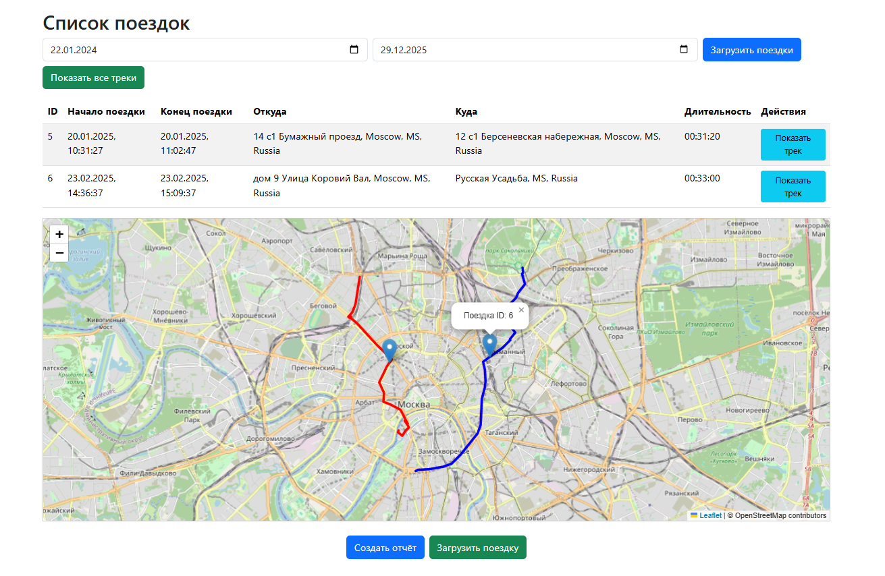
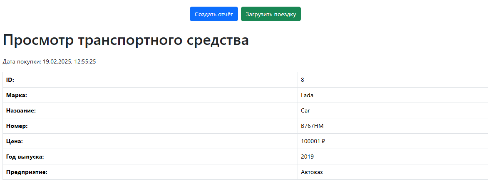

**Отчёт**

Возможно создание отчёта для автомобиля о пробеге в заданный период. Задаётся любой автомобиль по регистрационному номеру

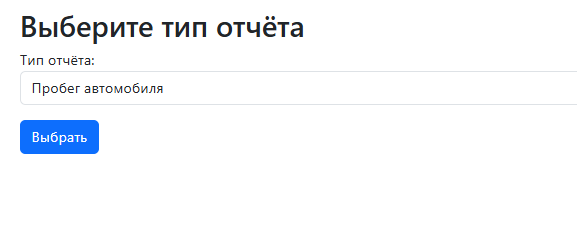
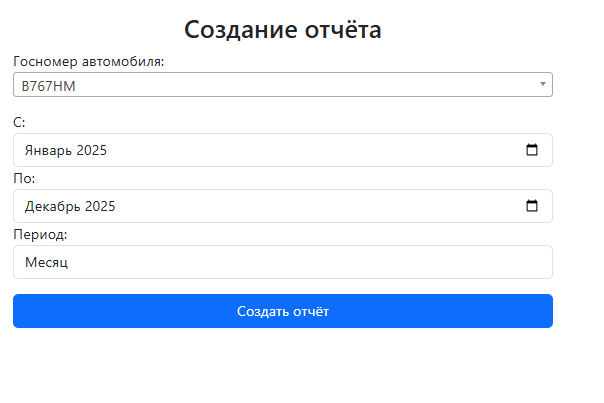

Отдельно можно загрузить трек через gpx

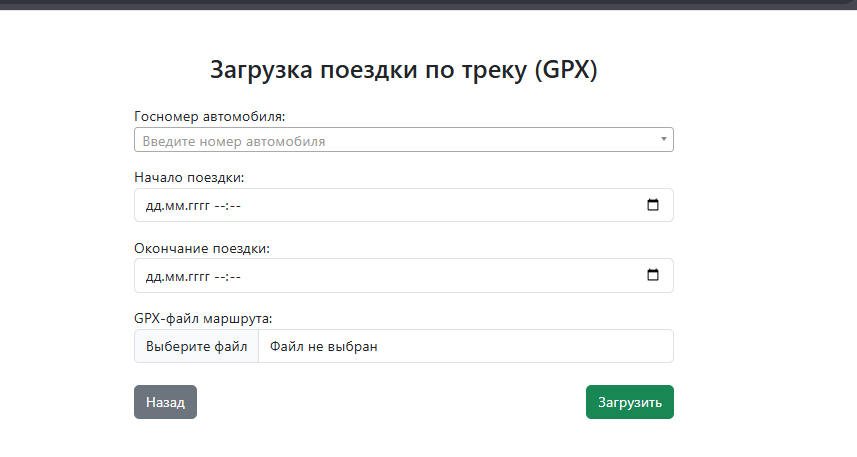

Была предоставлена возможность выдачи и загрузки данных о поездках в форматах JSON и CVS. Работа может производится как через ID, так и через UIID. Это не юзерфрендли, но демонстрирует возможную функциональность.

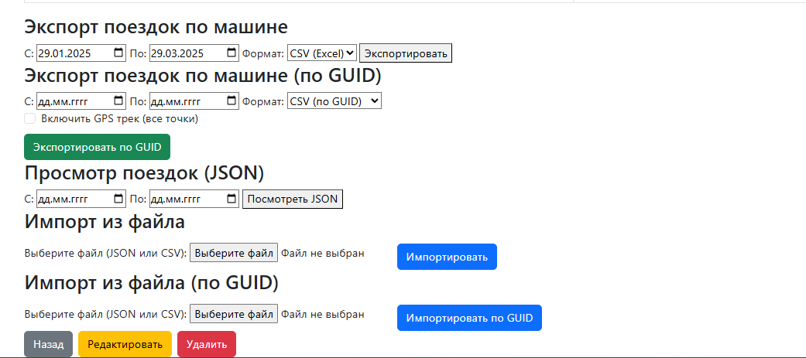

**REST API** и **Swagger**

На данный момент доступ предоставлен почти ко всем имеющимся конечным точкам для ручного управления. Но в соответствии с целесообразностью, я бы рассматривал сокрытие части из них в последующем.  
Для контроллеров API имеется документация с использованием Swagger:

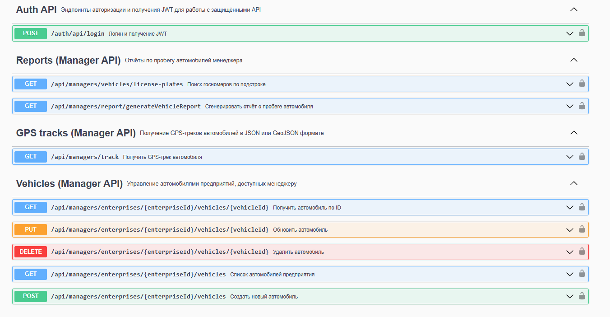

 ## **Режимы запуска**

В проекте имеется 3 режима запуска приложения A-B-C. Каждый с более расширенным функционалом.  
Условно назовём их кластерами.

Кластер A - запускает базовый проект Autopark + BD. 

Кластер B - добавляет к проекту сервис nоtify + grafana с дашбордами. В Grafana основное значение представляют алерты - 
сообщения об ошибках в приложении по типам SQL_ERRORS, HTTP_CLIENT_ERRORS(4xx, 5xx), LATENCY (>95). 
При их возникновении grafana отправляет сообщение в notify-service, который в свою очередь шлёт алерты в telegram bot.
Для этого необходимо настроить Telegram-чат.

Кластер C - добавляет к себе функционал vechicle-event(возможность получать информацию при манипулировании с транспортным средством), и формирование отчёта о пробеге автомобиля через личный чат телеграмм. 
Чат является общим для всех трёх видов взаимодействия(vechicle-event, отчёт и алерты) и производится исключительно через kafka.

Также можно проверить работу приложения на сервере по адресу https://saxophilyman-autopark.ru/
Предполагается поддерживать работу приложения как минимум до 15.05.2026

## **Запуск кластера A**
Cкачиваем проект и распаковываем его в рабочую директорию.
**(в разработке)**

 
## **Запуск кластера B**  
**(в разработке, но я уже пропишу шаги для последующей работы с ним)**  
Cкачиваем проект и распаковываем его в рабочую директорию.

**Шаг 1. Создайте бота(2 минуты)**
 - Откройте Telegram и найдите через поиск @BotFather
 - Напишите /newbot
 - Следуйте инструкциям
 - В конце BotFather даст вам TOKEN вида 123456:ABCDEF... и USERNAME бота (например my_autopark_bot)
 - Сохраните оба значения: TOKEN и USERNAME.

**Шаг 2. Запустите notify-service в режиме B (одной командой)**
В корне репозитория есть скрипт запуска кластера B:
 - Windows: run-notify-B.ps1
 - Linux/macOS: run-notify-B.sh

Запустите скрипт и передайте token + username. 

Windows (PowerShell)
.\ops\cluster-b\run-cluster-B.ps1 -TelegramBotToken "ВАШ_TOKEN" -TelegramBotUsername "ВАШ_USERNAME"

Linux/macOS/WSL (bash)
chmod +x ops/cluster-b/run-cluster-B.sh --token "ВАШ_TOKEN" --username "ВАШ_USERNAME"  

**Шаг 3. Узнайте свой chatId (это 10 секунд)**
 - В Telegram найдите вашего бота по имени и нажмите Start
 - Напишите боту команду:
            /start
 - Бот ответит сообщением, где будет строка:
            Твой chatId: 123456789
 - Это число и есть ваш chatId. Скопируйте его.

Шаг 4. Перезапустите notify-service уже с chatId (финал)
Остановите  текущий notify  Ctrl + C
Запустите notify снова, но уже с chatId:

Windows (PowerShell)
.\ops\cluster-b\run-cluster-B.ps1 -TelegramBotToken "ВАШ_TOKEN" -TelegramBotUsername "ВАШ_USERNAME" -TelegramAlertChatId "ВАШ_CHAT_ID"

Linux/macOS/WSL (bash)
chmod +x ops/cluster-b/run-cluster-B.sh --token "ВАШ_TOKEN" --username "ВАШ_USERNAME" --chatId "ВАШ_CHAT_ID"

Готово. Теперь алерты будут приходить в ваш личный чат с ботом.

Как проверить, что всё работает (быстрая проверка)
Убедитесь, что notify-service запущен http://localhost:8082/actuator/health - должно вернуть UP

Вы можете открыть Grafana и посмотреть дашборды:
http://localhost:3000
логин/пароль: admin / ChangeMeStrong

Протестировать механизм алертов можно перейдя по ссылке http://localhost:8082/dev/monitoring/smoke-test-grafana
В ваш чат tg должны придти уведомления об ошибках

 
## **Запуск кластера C**
**(в разработке)**
